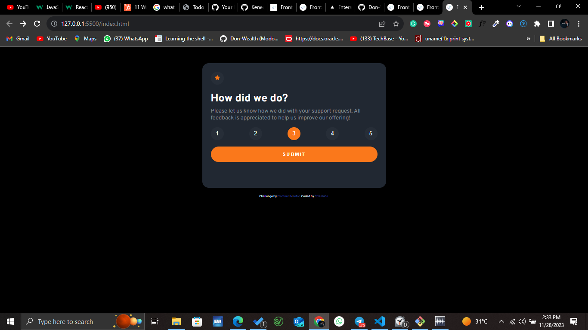

## Table of contents

- [Overview](#overview)
  - [The challenge](#the-challenge)
  - [Screenshot](#screenshot)
  - [Links](#links)
- [My process](#process)
  - [Built with](#built-with)
  - [What I learned](#what-i-learned)
- [Author](#author)
- [Acknowledgments](#acknowledgments)

## Overview

This is a solution to the [Interactive rating component challenge on Frontend Mentor](https://www.frontendmentor.io/challenges/interactive-rating-component-koxpeBUmI). Frontend Mentor challenges help you improve your coding skills by building realistic projects. 

### The challenge

Users should be able to:

- View the optimal layout for the app depending on their device's screen size
- See hover states for all interactive elements on the page
- Select and submit a number rating
- See the "Thank you" card state after submitting a rating

### Screenshot



### Links

- Solution URL: [GitHub Repo](https://github.com/Don-Wealth/interactive-rating)
- Live Site URL: [Live site](https://interactive-rating-indol.vercel.app/)

## Process
### Built with

- Semantic HTML5 markup
- CSS custom properties
- Flexbox
- JavaScript

### What I learned

I learnt how to redirect and query a url to save and get a parameter

Some codes I'm proud of
```css
.clicked{
  background-color: #fa781b;
  color: white;
}
```
```js
document.addEventListener("DOMContentLoaded", () => {
  // Get the rating from the query parameter
  const urlParams = new URLSearchParams(window.location.search);
  const rating = urlParams.get("rating");

  // Update the span with the retrieved rating
  const span = document.getElementById("user-selection");

  span.textContent = rating;
});
```


## Author

- GitHub - [Modozie Chika](https://github.com/Don-Wealth)
- Frontend Mentor - [@DonWealth](https://www.frontendmentor.io/profile/Don-Wealth)
- Twitter - [@DonWealth0001](https://twitter.com/DonWealth0001)

## Acknowledgments

Shout out to my Mentor. A Nigerian IT sorcerer
[@Kenechukwu Ubesie](https://github.com/Kenechvkwv). Thanks for the contribution and insight during this project.

